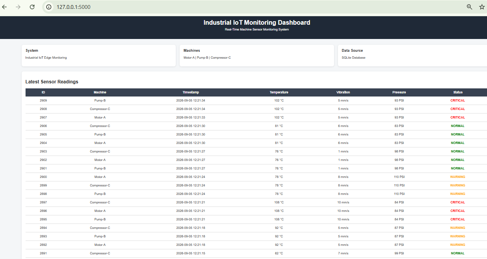

# 🏭 Real-Time Industrial IoT Edge Monitoring & Fault Detection System

A C-based Industrial IoT system for **real-time machine monitoring, fault detection, data logging, SQLite storage, TCP/IP communication, and web-based visualization**.

## 📸 Dashboard



## ✨ Features

- 🌡️ Real-time temperature monitoring
- 📳 Vibration monitoring
- ⚙️ Pressure monitoring
- 🚨 Normal / Warning / Critical fault detection
- 🧵 Multithreaded machine monitoring
- 🗄️ SQLite database storage
- 📝 Event logging
- 🌐 TCP/IP server communication
- 📡 MQTT publishing simulation
- 📊 Flask monitoring dashboard

## 🏗️ Architecture

```text
Sensors
   ↓
C Real-Time Processing
   ↓
Fault Detection
   ↓
SQLite Database + Event Logs
   ↓
TCP/IP Server
   ↓
Flask Dashboard
```

## 🛠️ Technologies

**C • GCC • POSIX Threads • SQLite • TCP/IP • Winsock2 • MQTT • Python • Flask • HTML • GitHub**

## 🖥️ Machines Monitored

- Motor-A
- Pump-B
- Compressor-C

## 🌐 Services

| Service | Address |
|---|---|
| TCP/IP Server | `127.0.0.1:9090` |
| Flask Dashboard | `http://127.0.0.1:5000/` |
| Database | `industrial_iot.db` |

## ▶️ Run

### Compile C System

```bash
gcc main.c src/sensor.c src/fault_detection.c src/database.c src/logger.c src/monitor.c src/network.c src/mqtt.c -Iinclude -o iot_monitor_final.exe -lsqlite3 -lws2_32 -pthread
```

### Start System

```bash
./iot_monitor_final.exe
```

### Start Dashboard

```bash
cd dashboard
python app.py
```

Open:

```text
http://127.0.0.1:5000/
```

## 🧪 Testing

```bash
gcc tests/test_fault_detection.c src/fault_detection.c -Iinclude -o fault_test
./fault_test
```

⭐ **Industrial IoT Edge Monitoring & Fault Detection System**
